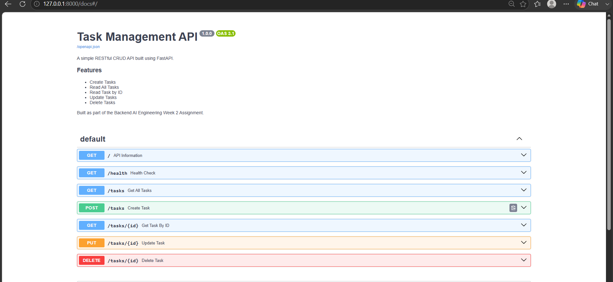

# Task Management API

A RESTful CRUD API built using FastAPI for the Backend AI Engineering Week 2 assignment.

## Features

- Create, Read, Update and Delete tasks
- Input validation
- Proper HTTP status codes
- Interactive Swagger UI documentation

## Tech Stack

- Python
- FastAPI
- Pydantic
- Uvicorn

## Installation

```bash
git clone https://github.com/Simi268/task-api.git
cd task-api
```

Create a virtual environment:

```bash
python -m venv venv
```

Activate it:

**Windows**

```bash
venv\Scripts\activate
```

**Linux/macOS**

```bash
source venv/bin/activate
```

Install dependencies:

```bash
pip install -r requirements.txt
```

## Run the API

```bash
uvicorn main:app --reload
```

Open:

- API: http://127.0.0.1:8000
- Swagger UI: http://127.0.0.1:8000/docs

## API Endpoints

| Method | Endpoint | Description |
|---------|----------|-------------|
| GET | `/` | API Information |
| GET | `/health` | Health Check |
| GET | `/tasks` | Get all tasks |
| GET | `/tasks/{id}` | Get task by ID |
| POST | `/tasks` | Create task |
| PUT | `/tasks/{id}` | Update task |
| DELETE | `/tasks/{id}` | Delete task |

## Project Structure

```text
task-api/
│── docs/
│   └── swagger.png
│── main.py
│── requirements.txt
│── README.md
│── .gitignore
```

## Swagger UI

