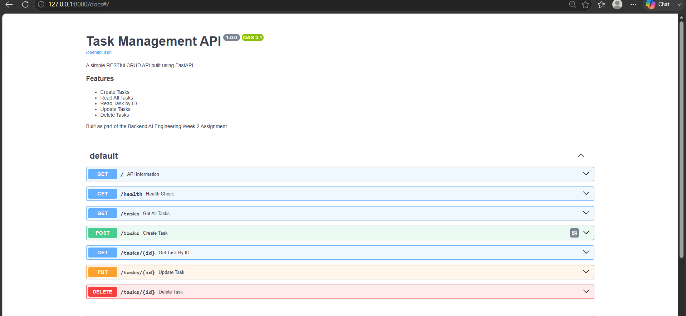
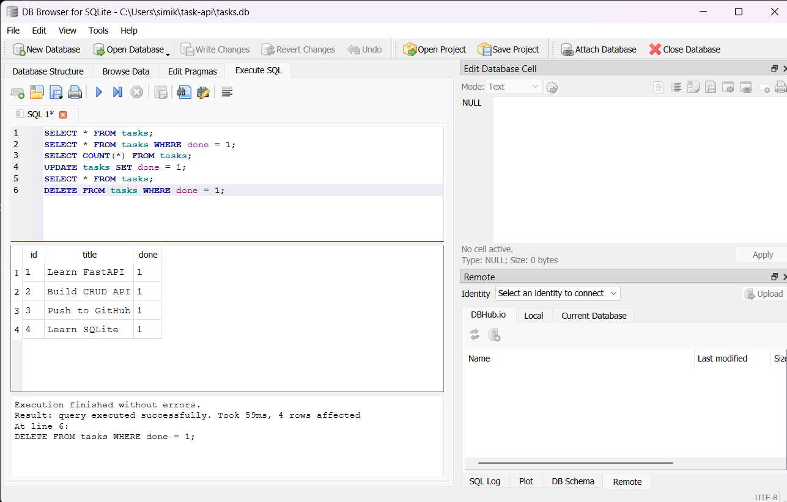

# Task Management API with Supabase Authentication

A RESTful CRUD API built using **FastAPI**, **SQLite**, and **Supabase Authentication** for the Backend AI Engineering assignment.

The API supports complete task management with persistent SQLite storage and secure JWT-based authentication using Supabase.

---

## Features

### Authentication

- User Signup
- User Login
- JWT Authentication
- Public Route
- Protected Route
- Reusable Authentication Dependency
- Swagger JWT Authorization

### Task Management

- Create Tasks
- Read All Tasks
- Read Task by ID
- Update Tasks
- Delete Tasks

---

## Tech Stack

- Python
- FastAPI
- Supabase Auth
- SQLite
- Pydantic
- Uvicorn

---

## Authentication

This project uses **Supabase Authentication**.

Authenticated users receive a JWT Access Token after login.

Protected endpoints verify this JWT before returning data.

Authentication flow:

```
Signup
      ↓
Login
      ↓
Access Token (JWT)
      ↓
Protected Routes
```

---

## Database

The project uses **SQLite** for persistent task storage.

SQLite was chosen because it:

- Stores the database in a single file
- Requires no separate database server
- Requires minimal setup
- Provides persistent storage across application restarts

Database file:

```
tasks.db
```

The application automatically creates the database and seeds sample tasks if it is empty.

---

## Installation

Clone the repository

```bash
git clone https://github.com/Simi268/task-api.git
cd task-api
```

Create virtual environment

```bash
python -m venv venv
```

Activate

### Windows

```bash
venv\Scripts\activate
```

### Linux/macOS

```bash
source venv/bin/activate
```

Install dependencies

```bash
pip install -r requirements.txt
```

---

## Environment Variables

Create a `.env` file.

```env
SUPABASE_URL=your_supabase_project_url
SUPABASE_KEY=your_supabase_publishable_key
```

---

## Run the Project

```bash
uvicorn app.main:app --reload
```

Open:

API

```
http://127.0.0.1:8000
```

Swagger

```
http://127.0.0.1:8000/docs
```

---

## API Endpoints

### Authentication

| Method | Endpoint | Description |
|---------|----------|-------------|
| POST | `/auth/signup` | Register a new user |
| POST | `/auth/login` | Login user |

### Public

| Method | Endpoint | Description |
|---------|----------|-------------|
| GET | `/public/info` | Public endpoint |

### Protected

| Method | Endpoint | Description |
|---------|----------|-------------|
| GET | `/protected/profile` | Requires JWT |

### Tasks

| Method | Endpoint |
|---------|----------|
| GET | `/tasks` |
| GET | `/tasks/{id}` |
| POST | `/tasks` |
| PUT | `/tasks/{id}` |
| DELETE | `/tasks/{id}` |

---

## Project Structure

```text
task-api/
│
├── app/
│   ├── __init__.py
│   ├── auth.py
│   ├── config.py
│   ├── dependencies.py
│   ├── routes.py
│   ├── supabase_client.py
│   └── main.py
│
├── docs/
│   ├── image.png
│   └── swagger.png
│
├── .env.example
├── .gitignore
├── README.md
├── requirements.txt
└── tasks.db
```

---

## Swagger UI

Interactive API documentation is available at:

```
http://127.0.0.1:8000/docs
```

Swagger supports JWT authentication using the **Authorize** button.



---

## Database Screenshot

SQLite database preview:



---

## HTTP Status Codes

| Code | Meaning |
|------|---------|
| 200 | OK |
| 201 | Created |
| 204 | No Content |
| 400 | Bad Request |
| 401 | Unauthorized |
| 404 | Not Found |

---

## Future Improvements

- Password Reset
- Email Verification
- Refresh Token Rotation
- Task Ownership per User
- Role-Based Authorization

---

## Author

**Simi Kumari**

Backend AI Engineering Assignment